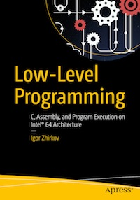

# Apress Source Code

This repository accompanies [*Low-Level Programming*](http://www.apress.com/9781484224021) by Igor Zhirkov (Apress, 2017).

[comment]: #cover

Download the files as a zip using the green button, or clone the repository to your machine using Git.

# Student projects

Each year, my students in ITMO university can opt to make a project that is connected to system programming or system programming languages in general instead of passing the final test. Each project is coded by one student, who is is free to chose a topic of interest. The source code is always available on GitHub and  video demonstrations are mandatory. 

The videos are being uploaded to [our YouTube channel](https://www.youtube.com/channel/UCOLTncnm6jVkO0pcPoIoHFg). Soon all available videos for all years are going to be uploaded.

# Repository structure 

This repository holds the following information:

* Book listings in [listings](listings)
* Answers to book questions in [questions/answers](questions/answers)
* Errors and typos are collected in [errata.md](errata.md)
* Sample solutions for assignments [assignments](assignments)
* FAQ about system setup at [FAQ.md](FAQ.md)
* The links to preconfigured Linux virtual machines:

1. **recommended if you are new to Linux**  Ubuntu 16 with standard desktop environment (VirtualBox): https://yadi.sk/d/CLf4D4IM3TSpsx

2. Debian 9 Minimal (.vmx) https://yadi.sk/d/BehMKGzS3LgXzG
  
  Mirror: http://rubber-duck-typing.com/files/low-level-programming-debian-minimal.zip
  
  
3.  Debian 9 with XFCE installed (more user friendly, than minimal one if you are not a Linux expert; more lightweight than Ubuntu) [https://yadi.sk/d/01uFWHCw3SHzh9](https://yadi.sk/d/01uFWHCw3SHzh9).
  
  Mirror: [http://rubber-duck-typing.com/files/low-level-programming-debian-desktop.zip](http://rubber-duck-typing.com/files/low-level-programming-debian-desktop.zip)
  
>  For all virtual machines: 
> 
>  Username: __user__, password: __user__, root password: __qwerty__

## Releases

Release v1.0 corresponds to the code in the published book, without corrections or updates.

## Contributions

See the file Contributing.md for more information on how you can contribute to
this repository.

I want to personally thank Kunio Yoshikawa for his amazing and most
effective contributions in finding errors and typos in the book. 

I also thank all readers who have provided me with feedback, critique and
corrections. Your work benefits the community!
